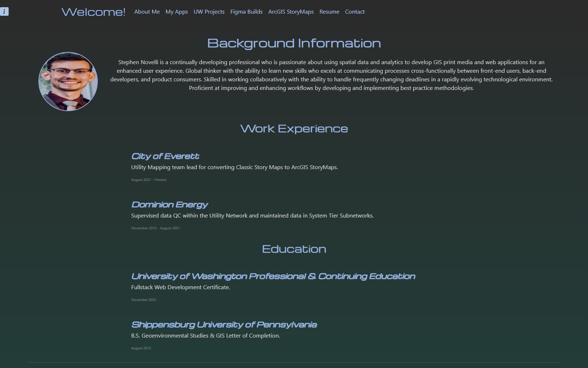

# Stephen Novelli Portfolio 
  
  # Table of Content
- [Stephen Novelli Portfolio ](#stephen-novelli-portfolio-)
- [Table of Content](#table-of-content)
  - [Description:](#description)
  - [Installation:](#installation)
  - [License:](#license)
  - [Tests:](#tests)
  - [Preview:](#preview)
  - [Deployment](#deployment)
  - [Accreditations:](#accreditations)

## Description:
This portfolio was built using React.js and designed with Bootstrap to showcase my web development skills for front end and back end design and implementation. The selected projects are a collection of assignments I created for my coding bootcamp course through the University of Washington Professional and Continuing Education. I have included downloadable copies of my resume and a contact form using emailJS for you to reach out to me. Be sure to check back periodically as I will be continually developing and deploying new content from my professional and personal life.

## Installation:
If you are using the Node.js runtime environment and want to run this app locally clone the repository and run "*npm run start*" from your command line. If you don't have Node installed or want to access my portfolio live click [here.](https://snovelli-portfolio.herokuapp.com/)

## License:
Copyright 2022, Stephen Novelli

Permission is hereby granted, free of charge, to any person obtaining a copy of this software and associated documentation files (the "Software"), to deal in the Software without restriction, including without limitation the rights to use, copy, modify, merge, publish, distribute, sublicense, and/or sell copies of the Software, and to permit persons to whom the Software is furnished to do so, subject to the following conditions:

The above copyright notice and this permission notice shall be included in all copies or substantial portions of the Software.

THE SOFTWARE IS PROVIDED "AS IS", WITHOUT WARRANTY OF ANY KIND, EXPRESS OR IMPLIED, INCLUDING BUT NOT LIMITED TO THE WARRANTIES OF MERCHANTABILITY, FITNESS FOR A PARTICULAR PURPOSE AND NONINFRINGEMENT. IN NO EVENT SHALL THE AUTHORS OR COPYRIGHT HOLDERS BE LIABLE FOR ANY CLAIM, DAMAGES OR OTHER LIABILITY, WHETHER IN AN ACTION OF CONTRACT, TORT OR OTHERWISE, ARISING FROM, OUT OF OR IN CONNECTION WITH THE SOFTWARE OR THE USE OR OTHER DEALINGS IN THE SOFTWARE.

[View License](https://www.mit.edu/~amini/LICENSE.md) 
       
## Tests:
No tests are currently required to run this application.
    
## Preview:

## Deployment

This app was deployed using the Heroku Buildpack for Node.js and can be seen live [here.](https://snovelli-portfolio.herokuapp.com/)

## Accreditations:
A special thank you to Chaoo Charles who recorded an awesome explanation of using emailJS to create a contact form that sends results to email. 

"Chaoo Charles. (March 23, 2022). *React: Send email from contact form without server code - Email.js Tutorial* [[Video]](https://www.youtube.com/watch?v=bMq2riFCF90). YouTube. https://www.youtube.com/watch?v=bMq2riFCF90"